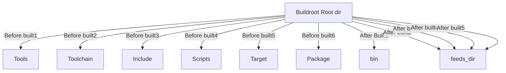

-----------------------------------------------------------------------------
#Tutorials for Openwrt source code structure
----------------------------------------------------------------------------
1. General source structure:

 - /config : Configuration file for **make menuconfig**

 - /include: Makefile configurations file

 - /package:packages makefile and configuration

 - /scripts: extra scripts through build process

 - /target: makefile and configuration for building imagebuilder, kerneland the toolchain built by buildroot

 - /toolchain: makefile and configuration for building the toolchain

 - /tools : extra tools used throughout the build process
### Structure of OpenWRT source code

----------------------------------------------------------------------------------
Author: Duy. Ho
Date: 14/11/2019
email:duyhohung.work@gmail.com
